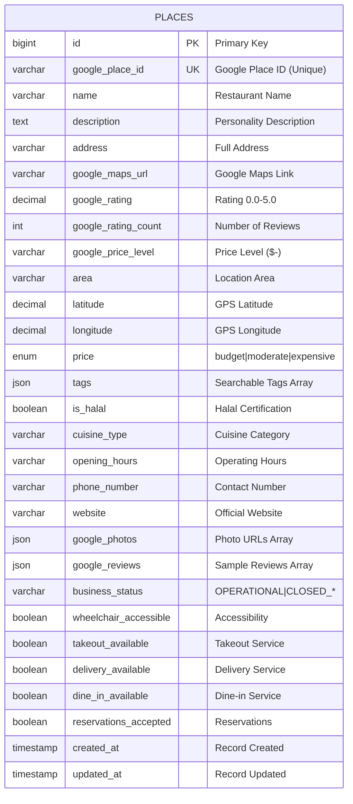
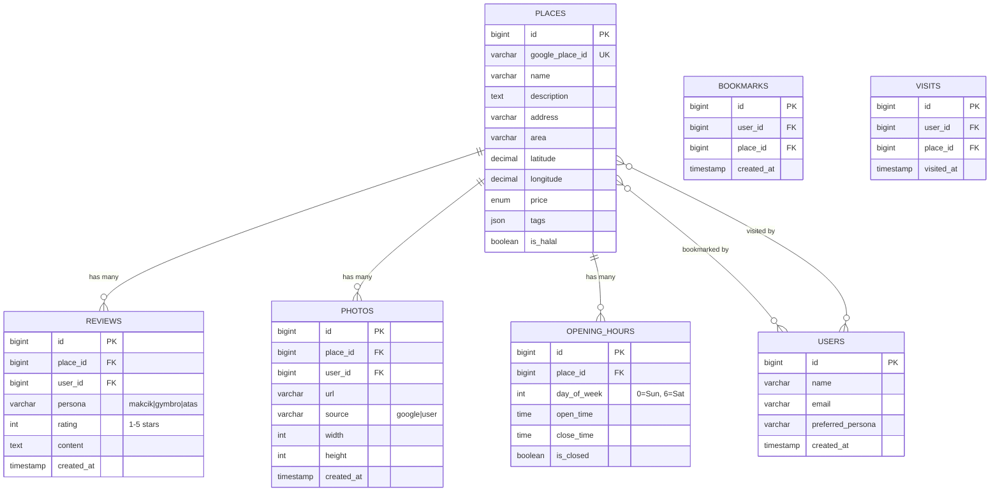
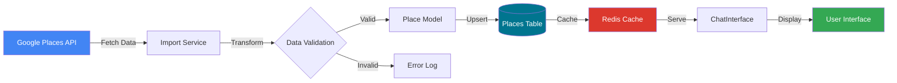
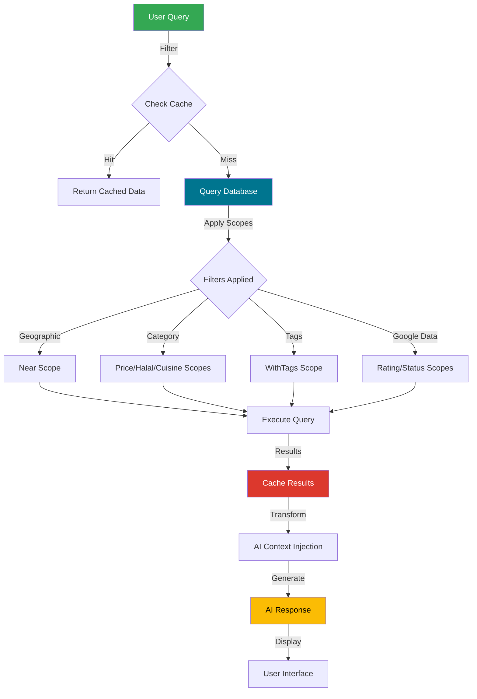

# MakanGuru - Entity Relationship Diagram (ERD)

This document provides a visual representation of the MakanGuru database schema using Mermaid diagrams.

## Current Schema (v2.0)



## Table Relationships (Future)

The following diagram shows planned future relationships:



## Indexes Visualization

### Current Indexes

```
Primary Key:
┌────────────┐
│ id (PK)    │
└────────────┘

Unique Key:
┌──────────────────────┐
│ google_place_id (UK) │
└──────────────────────┘

Composite Index:
┌─────────┬─────────┐
│ area    │ price   │
└─────────┴─────────┘

Single Indexes:
┌──────────────────┐
│ is_halal         │
└──────────────────┘

┌──────────────────┐
│ google_place_id  │
└──────────────────┘

┌──────────────────┐
│ google_rating    │
└──────────────────┘

┌──────────────────┐
│ business_status  │
└──────────────────┘
```

## Data Flow Diagram

### Google Maps Integration Flow



### User Query Flow



## Schema Evolution

### Version 1.0 (Initial)
- Core place information
- Geographic coordinates
- Basic filtering (price, halal, area)
- Tags system

### Version 2.0 (Current - with Google Maps)
- ✅ Google Place ID integration
- ✅ Google ratings and reviews
- ✅ Business status tracking
- ✅ Service options (takeout, delivery, dine-in)
- ✅ Accessibility features
- ✅ Contact information (phone, website)
- ✅ Photo galleries

### Version 3.0 (Planned)
- 🔲 User authentication system
- 🔲 User-generated reviews
- 🔲 Bookmarks/favorites
- 🔲 Visit history tracking
- 🔲 Structured opening hours
- 🔲 Photo management system

## Field Groups Visualization

```
┌─────────────────────────────────────────────────────┐
│                    PLACES TABLE                      │
├─────────────────────────────────────────────────────┤
│                                                      │
│  ┌────────────────────────────────────────────┐    │
│  │  CORE IDENTITY                              │    │
│  │  • id, name, description, address          │    │
│  └────────────────────────────────────────────┘    │
│                                                      │
│  ┌────────────────────────────────────────────┐    │
│  │  LOCATION                                   │    │
│  │  • area, latitude, longitude               │    │
│  └────────────────────────────────────────────┘    │
│                                                      │
│  ┌────────────────────────────────────────────┐    │
│  │  CATEGORIZATION                             │    │
│  │  • price, tags, is_halal, cuisine_type     │    │
│  └────────────────────────────────────────────┘    │
│                                                      │
│  ┌────────────────────────────────────────────┐    │
│  │  GOOGLE INTEGRATION                         │    │
│  │  • google_place_id, google_rating          │    │
│  │  • google_maps_url, google_photos          │    │
│  │  • google_reviews, business_status         │    │
│  └────────────────────────────────────────────┘    │
│                                                      │
│  ┌────────────────────────────────────────────┐    │
│  │  CONTACT & HOURS                            │    │
│  │  • opening_hours, phone_number, website    │    │
│  └────────────────────────────────────────────┘    │
│                                                      │
│  ┌────────────────────────────────────────────┐    │
│  │  SERVICE OPTIONS                            │    │
│  │  • takeout_available, delivery_available   │    │
│  │  • dine_in_available, reservations         │    │
│  │  • wheelchair_accessible                   │    │
│  └────────────────────────────────────────────┘    │
│                                                      │
│  ┌────────────────────────────────────────────┐    │
│  │  METADATA                                   │    │
│  │  • created_at, updated_at                  │    │
│  └────────────────────────────────────────────┘    │
│                                                      │
└─────────────────────────────────────────────────────┘
```

## Query Complexity Analysis

### Simple Queries (Fast - Uses Single Index)
```sql
-- Price filter
WHERE price = 'budget'

-- Halal filter
WHERE is_halal = TRUE

-- Rating filter
WHERE google_rating >= 4.0

-- Business status
WHERE business_status = 'OPERATIONAL'
```

### Medium Queries (Moderate - Uses Composite Index)
```sql
-- Area + Price
WHERE area LIKE '%Bangsar%' AND price = 'budget'
```

### Complex Queries (Slower - Multiple Scopes)
```sql
-- Geospatial + Multiple Filters
WHERE (6371 * acos(...)) <= 5  -- Haversine
  AND is_halal = TRUE
  AND price = 'budget'
  AND google_rating >= 4.0
  AND business_status = 'OPERATIONAL'
```

### JSON Queries (Slowest - Full Scan Required)
```sql
-- Tag search
WHERE JSON_CONTAINS(tags, '"nasi lemak"')
```

**Optimization**: Redis caching reduces 90% of repeated queries

---

## Database Statistics

| Metric | Current | Target (Production) |
|--------|---------|---------------------|
| Total Tables | 1 | 6 (with user system) |
| Total Columns | 30 | ~80 |
| Indexes | 7 | ~15 |
| Average Row Size | ~2 KB | ~3 KB |
| Expected Records | 50-100 | 5,000-10,000 |
| Storage Required | < 1 MB | ~30 MB |
| Query Response Time | < 100ms | < 50ms (with Redis) |

---

**Last Updated**: 2025-12-19
**Schema Version**: 2.0 (Google Maps Integration)
**ERD Tool**: Mermaid.js
